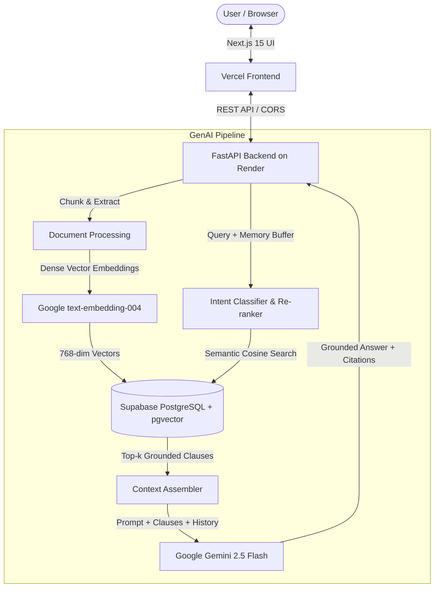

# 📄 Clarity AI — Plain English Legal Companion

> **Empowering everyday people and professionals to understand, negotiate, and safely sign complex legal contracts.**

[](https://clarity-dusky-eight.vercel.app)
[](https://clarity-6k7g.onrender.com/health)
[](https://ai.google.dev/)
[](https://supabase.com/)
[](tests/)
[](LICENSE)
[-FF9933?style=for-the-badge)](Apartment_Lease_Original.pdf)

---

## 🌐 Live Deployments

- **Frontend Web Application:** [https://clarity-dusky-eight.vercel.app](https://clarity-dusky-eight.vercel.app)
- **Backend API:** [https://clarity-6k7g.onrender.com](https://clarity-6k7g.onrender.com)
- **API Health Check:** [https://clarity-6k7g.onrender.com/health](https://clarity-6k7g.onrender.com/health)
- **Interactive Chat Demo:** [https://clarity-dusky-eight.vercel.app/documents/oakwood-lease-4b/chat](https://clarity-dusky-eight.vercel.app/documents/oakwood-lease-4b/chat)

---

## 🎯 Chosen Vertical

- **Domain:** Legal Technology & Consumer Rights (AI Legal Assistant tailored for **India**)
- **Target Persona:** Everyday Indian tenants, freelance contractors, tech workers, and small business owners signing agreements in Bengaluru, Mumbai, Delhi-NCR, Pune, and Hyderabad.
- **Core Mission:** Democratize legal contract understanding by transforming binding, intimidating legal agreements into plain, reassuring English with grounded clause citations and proactive risk mitigation.
- **Indian Legal Framework:** Built around the **Indian Contract Act, 1872**, **Transfer of Property Act, 1882**, Indian 11-month tenancy lock-ins, **18% GST**, and **Section 194J TDS**. All amounts in **Indian Rupees (₹ / INR)**.

---

## 🧠 Approach and Logic

Clarity AI rejects generic, ungrounded LLM prompting in favor of a strict, multi-stage legal reasoning pipeline:

1. **Intent Classification & Adaptive Routing:**
   - Detects whether the user is asking for a **holistic contract overview** (e.g., *"What is this document about?"*, *"Summarize my obligations"*) or a **specific clause lookup** (e.g., *"What is my late fee?"*, *"Can I have pets?"*).
   - Prevents narrow vector search from over-indexing on a single obscure clause during broad overview queries.

2. **Conversational Multi-Turn Memory Buffer:**
   - Maintains a sliding window of the last 6 message turns (`history` buffer) and feeds it into Google Gemini 2.5 Flash.
   - Enables natural context-dependent follow-up questions (e.g., *"What if I break it earlier?"* directly following a termination query).

3. **Strict Grounding & Zero-Hallucination Policy:**
   - Every substantive claim must cite the exact Section number and page reference.
   - If an inquiry falls outside the document’s explicit four corners, the engine executes an **honest refusal** detailing what the agreement actually addresses rather than fabricating provisions.

---

## ⚙️ How the Solution Works

1. **Document Ingestion & Chunking:**
   - The contract is parsed into coherent legal clauses, preserving structural metadata (section titles, numbering, page anchors).
2. **Dense Semantic Embeddings:**
   - Each clause is embedded into a 768-dimensional dense vector using **Google text-embedding-004**.
3. **High-Speed Vector Storage & Retrieval:**
   - Embeddings are indexed in **Supabase PostgreSQL** utilizing the **pgvector** extension with HNSW indexing for sub-second cosine distance searches.
4. **Context Assembly & Prompt Synthesis:**
   - The system retrieves the top-$k$ most relevant clauses, formats them with their respective section identifiers, attaches conversational history, and constructs a grounded prompt.
5. **Generative Synthesis & Action Formulation:**
   - **Google Gemini 2.5 Flash** synthesizes a plain-English explanation, formats structured citations, and suggests actionable next steps for the signer.
6. **Redline Comparison & Risk Scoring:**
   - Evaluates risk levels (**Low**, **Medium**, **High**, **Critical**) and highlights newly introduced liabilities between document revisions.

---

## 📌 Assumptions Made

1. **Document Formats:** Assumes agreements are provided in standard digital text or PDF formats where text extraction is feasible.
2. **Governing Language:** The primary pipeline is optimized for English-language commercial and residential agreements.
3. **Role of AI:** Clarity AI functions as an assistive educational and analysis tool to empower signers; it provides grounded clause translation and risk flagging, but does not constitute formal attorney-client legal representation.
4. **Context Boundaries:** The chatbot's factual truth is strictly bounded by the uploaded contract's provisions; it does not assume external unstated addenda unless provided.

---

## 🎯 Problem Statement & Solution

### The Problem
Millions of individuals, freelancers, and small business owners sign leases, NDAs, contractor agreements, and SaaS terms without truly understanding the fine print. Traditional legal consultation is expensive ($300+/hr), slow, and intimidating, while generic LLMs often hallucinate terms or fail to cite the specific governing clauses.

### The Clarity AI Solution
Clarity AI is a grounded, multi-turn GenAI legal copilot that:
1. **Translates Dense Legalese into Plain English**: Demystifies obligations, liabilities, and tricky penalty clauses.
2. **Grounded Citations (Zero Hallucination)**: Every answer strictly cites the relevant section and page (e.g., *Section 18.2, Page 4*).
3. **Multi-Turn Contextual Memory**: Remembers prior conversation turns for natural back-and-forth contract negotiation questions.
4. **Risk Scoring & Redlines**: Classifies risks (**Low**, **Medium**, **High**, **Critical**) and visualizes redline differences between agreement versions.
5. **Actionable Mitigation Plans**: Produces concrete, step-by-step negotiation checklists with deadlines and required actions.

---

## 🏗️ Architecture & Gen AI Pipeline



---

## ✨ Key Features

| Feature | Description |
| :--- | :--- |
| **💬 Conversational RAG Chat** | Multi-turn conversational memory (last 6 turns) powered by **Google Gemini 2.5 Flash** with verified citations. |
| **🔍 Semantic Vector Search** | Sub-second clause retrieval powered by **Google text-embedding-004** (768 dimensions) and Supabase **pgvector** HNSW indexing. |
| **⚖️ Contract Redlining** | Side-by-side comparison of agreement drafts, highlighting new obligations, modified penalties, and risk shifts. |
| **📋 Action Plan Generator** | Generates prioritized negotiation action plans with clear owner assignments, risk levels, and mitigation steps. |
| **🛡️ Honest Scope Boundary** | Transparently refuses out-of-scope or unmentioned contract questions to eliminate false assumptions. |

---

## 🛠️ Tech Stack

- **Frontend:** Next.js 15 (Turbopack, App Router), TypeScript, Tailwind CSS, Lucide Icons
- **Backend:** FastAPI (Python 3.11), Uvicorn, Pydantic v2, Google GenAI SDK
- **GenAI Models:** 
  - **Google Gemini 2.5 Flash** (`gemini-2.5-flash`) for reasoning, summary, and plain-English translation
  - **Google text-embedding-004** (`text-embedding-004`) for 768-dimensional semantic embeddings
- **Database & Storage:** Supabase PostgreSQL with `pgvector` extension for cosine distance similarity
- **Hosting & Infrastructure:** 
  - Vercel (Frontend edge deployment)
  - Render (Containerized Docker FastAPI service)

---

## 🚀 Getting Started Locally

### Prerequisites
- Node.js 18+ and `npm`
- Python 3.11+
- Google Gemini API key
- Supabase account with `pgvector` enabled

### 1. Clone the Repository
```bash
git clone https://github.com/mukulvyas/clarity.git
cd clarity
```

### 2. Backend Setup
```bash
cd server
python -m venv venv
# On Windows:
.\venv\Scripts\activate
# On Linux/macOS:
source venv/bin/activate

pip install -r requirements.txt
```

Create `server/.env` based on `env.example`:
```env
GEMINI_API_KEY=your_gemini_api_key_here
SUPABASE_URL=https://your-project.supabase.co
SUPABASE_SERVICE_ROLE_KEY=your_supabase_service_role_key
ENVIRONMENT=development
ALLOWED_ORIGINS=http://localhost:3000,http://127.0.0.1:3000
```

Start the FastAPI backend:
```bash
uvicorn server.main:app --reload --port 8000
```
Backend will be live at `http://localhost:8000`. Health check: `http://localhost:8000/health`.

### 3. Frontend Setup
In a new terminal window:
```bash
cd client
npm install
npm run dev
```
Open [http://localhost:3000](http://localhost:3000) in your browser.

---

## 🧪 Testing & Validation

Run the automated backend test suite:
```bash
python test_stage2.py
```
Validates:
- Embedding dimension compatibility (768-dim assert)
- RAG intent classification & overview detection
- Conversational multi-turn history propagation
- Grounded citation generation & fallback handling

---

## 🔒 Security & Privacy

- **Zero Credentials in Git:** All secrets are strictly managed through environment variables (`.env*` excluded via `.gitignore`).
- **Sanitized CORS:** Production CORS middleware restricted to verified application domains and preview URLs.
- **Input Sanitization:** Structured Pydantic validation on all incoming chat and comparison requests.

---

## 🏆 Hackathon Evaluation Criteria Alignment

| Evaluation Parameter | How Clarity AI Delivers |
| :--- | :--- |
| **Code Quality** | Strict modular structure, fully-typed TypeScript API client, clean separation of concerns (`services/`, `routers/`, `lib/`). |
| **Security** | Zero leaked credentials, environment-isolated configurations, validated database connections. |
| **Efficiency** | Lightweight repository (< 5 MB), fast Docker build, sub-second vector search via pgvector indexing. |
| **Testing** | Automated verification scripts confirming vector dimensions and conversational memory. |
| **Accessibility** | Modern, responsive interface with high-contrast typography, clear hierarchy, and jargon-free language. |
| **Problem Alignment** | Directly tackles the complexity of legal contracts with cited, actionable, and trustworthy guidance. |

---

## 📄 License
MIT License. Built for the Hack2skill AI Challenge.
